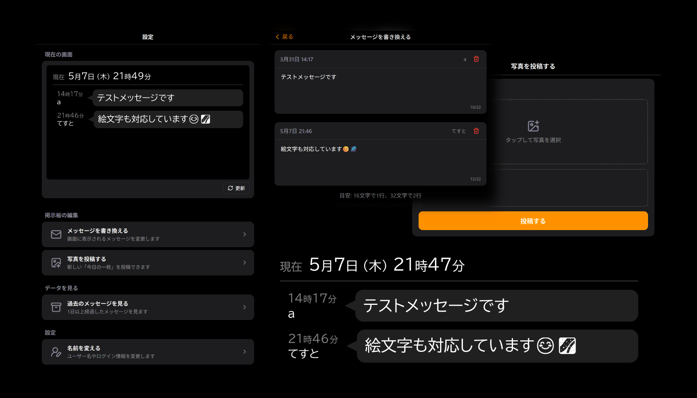

<div align="center">
  <h1>Karuma</h1>
  
  

  
</div>

---

**Karuma** は、固定ディスプレイに表示する一方向情報伝達用掲示板アプリケーションです。
メッセージ、写真を 30 秒ごとにローテーション表示し、これらは Web 管理画面から遠隔で更新が可能です。

描画には Rust (Slint UI) を使用しています。
ARMv7 Linux で使用可能 (ディスプレイサーバー不要) かつ最小限のディスク書き込みになるように設計しています。

## 実行

```bash
cargo run
```

## クロスコンパイル

Docker と `cross` を使用して、Windows 上で ARMv7 Linux 向けにクロスコンパイルも可能です。

```bash
cross build --target armv7-unknown-linux-musleabihf --release
```

## 特徴

### API

API サーバーはポート **20400** で起動します。

- `GET /api/messages`: メッセージ取得
- `PUT /api/messages`: メッセージ更新
- `GET /api/messages/archives`: アーカイブ日付一覧
- `GET /api/messages/archives/{date}`: 指定日付のアーカイブ
- `GET /api/pictures`: 写真一覧（最新順）
- `POST /api/pictures`: 写真アップロード
- `GET /api/pictures/{id}`: 写真取得 (認証不要)
- `GET /api/snapshot`: UI スナップショット (PNG)

### メッセージ管理
- **Debounce 保存**: 変更から 30 秒後に一度だけディスク保存
- **毎日午前 3 時に自動アーカイブ化** (`archives/messages-YYYYMMDD.toml`)

### 写真管理
- **WebP + テキスト形式**: `data/pictures/YYYYMMDD-XXXX.{webp,txt}`
- **30 分ごとにランダム表示** (50% で投稿写真、50% で猫画像)
